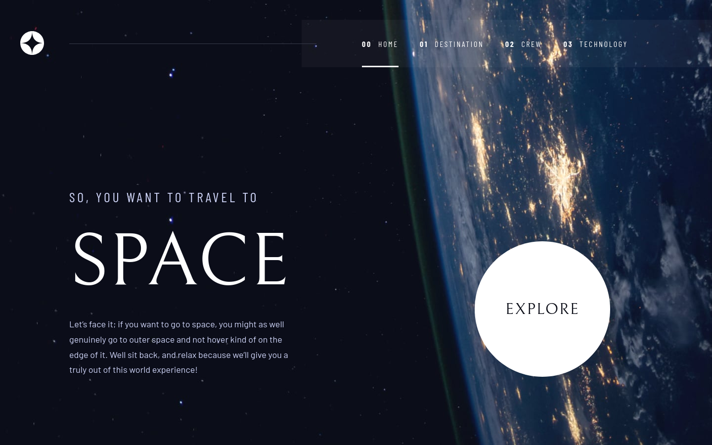

# Frontend Mentor - Space tourism website solution

This is a solution to the [Space tourism website challenge on Frontend Mentor](https://www.frontendmentor.io/challenges/space-tourism-multipage-website-gRWj1URZ3). Frontend Mentor challenges help you improve your coding skills by building realistic projects. 

## Table of contents

- [Overview](#overview)
  - [The challenge](#the-challenge)
  - [Screenshot](#screenshot)
  - [Links](#links)
- [My process](#my-process)
  - [Built with](#built-with)
  - [What I learned](#what-i-learned)
  - [Continued development](#continued-development)
  - [Useful resources](#useful-resources)
- [Author](#author)
- [Acknowledgments](#acknowledgments)

**Note: Delete this note and update the table of contents based on what sections you keep.**

## Overview

### The challenge

Users should be able to:

- View the optimal layout for each of the website's pages depending on their device's screen size
- See hover states for all interactive elements on the page
- View each page and be able to toggle between the tabs to see new information

### Screenshot

### Links

- Solution URL: https://github.com/hebrerillo/space-tourism-challenge
- Live Site URL: https://tourism-space-challenge.netlify.app/index.html

## My process

### Built with

- Semantic HTML5 markup
- CSS custom properties
- Flexbox
- CSS Grid
- Vanilla JavaScript
- Mobile-first workflow
- Sass

### What I learned

I learned how to center a grid item that has a maximum width:
    - https://codepen.io/hebrerillo/pen/rNvNPRo
    - https://codepen.io/hebrerillo/pen/xxWYvqZ

Besides the media queries defined in Figma, I added two more media queries to strengthen my layout skills:
    - A media query for small desktops with a min-width of 1024px.
    - A media query for big desktops with a min-width of 1700px.
    
For normal desktops (min-width: 1440px), the main content and the thin bar on the header are aligned to the left, as specified in the Figma file.

If you hover over the links in navigation menu of the header, you will realize that the links only occupy the necessary height, they do not stretch to the bottom of the navigation menu to show the border bottom when hovering. I achieved this using pseudo elements.

This project was also a good opportunity to improve my Sass skills.

### Continued development

I think I still have to improve the layout of responsive and flexible images.

### Useful resources

- https://developer.mozilla.org/en-US/

## Author

- Frontend Mentor - [hebrerillo] https://www.frontendmentor.io/profile/hebrerillo 

## Acknowledgments

As always, I want to thank the Mozilla Developer Network for the great documentation they provide on HTML, CSS and JavaScript, but also for the very good articles they write about such technologies.
